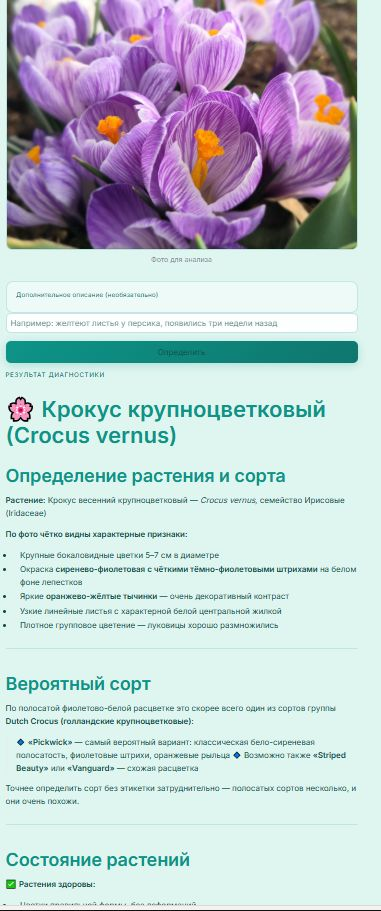
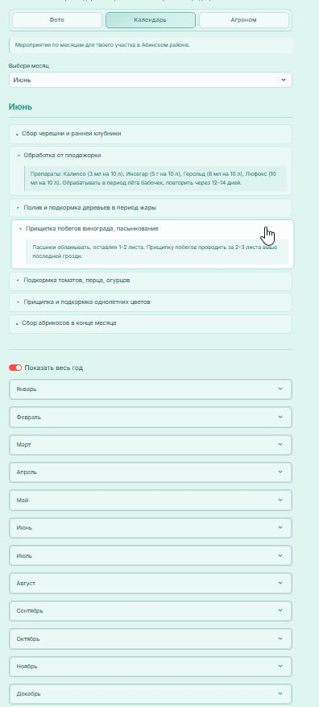
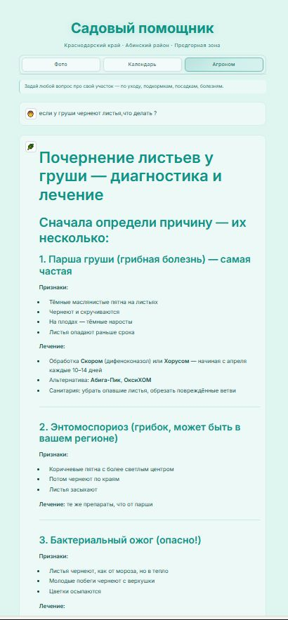

# Садовый помощник

Веб-приложение для садовода с собственным участком. Заменяет поиск по разным источникам: сезонный план работ, диагностика растений по фото и вопросы агроному — всё в одном месте.

Разработано для участка в Краснодарском крае, Абинском районе. Может использоваться для любого региона.

## Для кого

Садовод с частным участком — огород, деревья, цветники. Без специальных знаний: загружаешь фото или задаёшь вопрос и получаешь конкретный ответ.

## Скриншоты

| Фото-диагностика | Сезонный календарь | Чат с агрономом |
|---|---|---|
|  |  |  |

## Возможности

- **Фото-диагностика** — загрузи фото или сними прямо с телефона. Приложение определит растение, болезнь или вредителя и даст рекомендации по лечению
- **Сезонный календарь** — список мероприятий по месяцам с учётом климата. Препараты, дозировки, сроки
- **Чат с агрономом** — задай любой вопрос по уходу, подкормкам, посадкам, обрезке

## В планах

- Планирование сада и клумб — фотографируешь участок и просишь создать гармоничную композицию на основе фото

## Технологии

- [Streamlit](https://streamlit.io) — интерфейс
- [Anthropic Claude](https://anthropic.com) — AI с поддержкой анализа изображений
- Python 3.9+

## Локальный запуск

```bash
pip install -r requirements.txt
```

Создай файл `.env` на основе `.env.example`, вставь API-ключ с [console.anthropic.com](https://console.anthropic.com):

```
ANTHROPIC_API_KEY=sk-ant-ваш-ключ
```

```bash
streamlit run app.py
```
